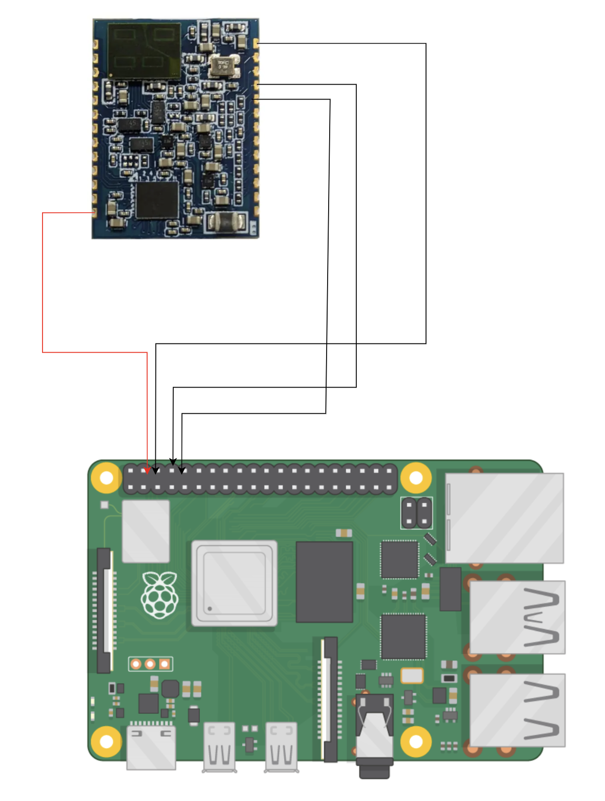
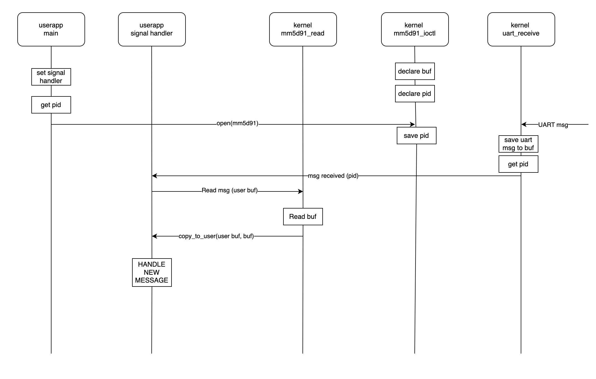

# MM5D91 driver for RPI4.
* Still under construction. 
* is run on raspian bullseye. If bookworm in use then compiler flag BW to be used.
## Wiring of RPI4B to mm5d91

## Prerequisite
* sudo apt install raspberrypi-kernel-headers
* sudo cp mm5d91_overlay.dtbo /boot/overlays
* sudo vi /boot/config.txt
    * add "dtoverlay=mm5d91_overlay"
* sudo raspi-config
    * interfaces->serial->login shell to be accessible over serial -> NO
    * interfaces->serial->Serial port hardware enabled -> YES
    * reboot raspi
## Install to kernel
* sudo insmod mm5d91_driver.ko
## Remove from kernel
* sudo rmmod mm5d91_driver
## Compile
* make
## Userapp compile
* gcc usertestapp.c -o usertestapp
## Run user app
* ./usertestapp
## Message path from kernel to user app.

## TODO
* missing unit tests
* add some checks to make more robust (i.e. GOTOs)
